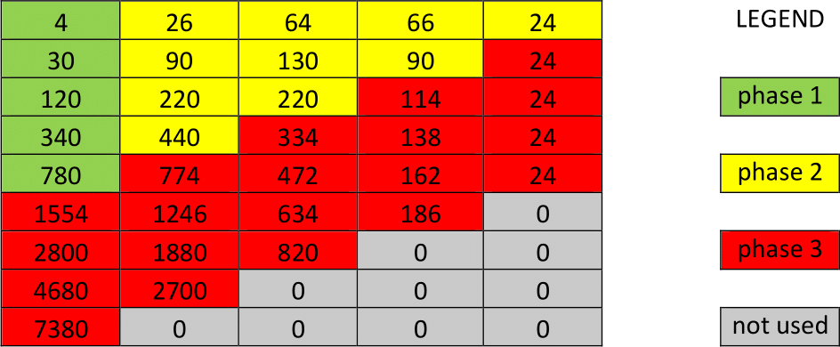
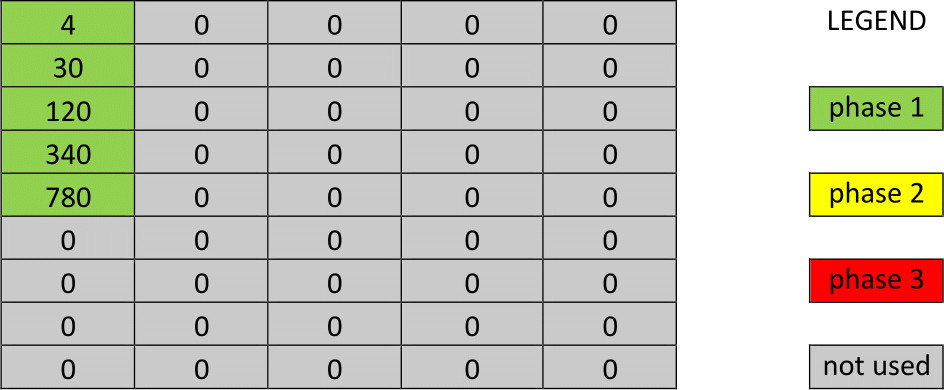
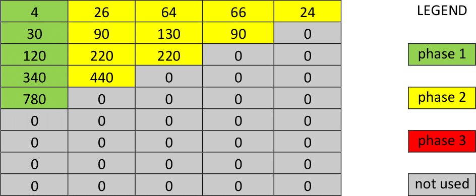

# Exam of 18.06.2020 - Part II - A
Exam of the Computer Architectures course of the master degree in Embedded System (Electronic Engineering) of Politecnico di Torino.<br/>
Tested in Keil uVision5.

## Exam Text
*Note*: Assembly subroutines must comply with the ARM Architecture Procedure Call Standard (AAPCS) standard (about parameter passing, returned value, callee-saved registers).<br/>
In all subroutines, you can assume that the matrix is big enough to contains all values.

Let *p(x)* be a *n*-th degree polynomial: 

<p align="center">


The coefficients *k<sub>i</sub>* are unknown, but we know the values of *p(1)*, *p(2)*, ..., *p(n+1)*. We want to compute the value of *p(m)*, with *m* > *n*, using the method of the divided differences. We use a matrix *M* with m rows and *n+1* column. The element at row *i* and column *j* is indicated as *M[i][j]*. We apply the following algorithm:
- **Phase 1**: the elements on the first column *M[0][0]*, *M[1][0]*, ..., *M[n][0]* are initialized with the values of *p(1)*, *p(2)*, ..., *p(n+1)*.
- **Phase 2**: the value of an element *M[i][1]* on the second column is set as: *M[i][1]* = *M[i+1][0]* - *M[i][0]*. In this way, the first *n* elements on the second column are set.<br/>
The value of the first *n-1* elements on the third column are computed as the difference of the elements of the second column: *M[i][2]* = *M[i+1][1]* - *M[i][1]*.<br/>
By applying the same rule to all columns, finally we compute the value of the first element of the last column *M[0][n]*.
- **Phase 3**: the value of *M[0][n]* is copied into the first *n+1* elements of the last column. Then, any element *M[i][j]*, with *j* < *n-1*, is computed as: *M[i][j]* = *M[i-1][j]* + *M[i-1][j+1]*.

Example: *p(x)* is a fourth order polynomial, with *p(1)* = 4, *p(2)* = 30, *p(3)* = 120, *p(4)* = 340, *p(5)* = 780. We want to compute the value of *p(9)*. We use a matrix with 9 rows and 5 columns.

<p align="center">
  
</p>

At the end, we obtain *p(9)* = 7380. Note: unused elements must be left to zero.

### Specification 1 (4 points)
Write a `initializeMatrix` subroutine that receives in input:
1) address of a zeroed block of memory: it represents the matrix
2) address of an array: it contains the values *p(1)*, *p(2)*, ..., *p(n+1)*
3) *n+1*: grade of the polynomial + 1, i.e., number of values in the array

The subroutine implements the phase 1 of the algorithm of divided differences. It does not return any value.

Example of calling code
```
        AREA  matrixDeclaration, DATA, READWRITE
matrix  SPACE 2000
        AREA  arrayInitialization, DATA, READONLY
array   DCD 4, 30, 120, 340, 780

        AREA  |.text|, CODE, READONLY
Reset_Handler PROC
        LDR   r0, =matrix
        LDR   r1, =array
        MOV   r2, #5          ; number of values in the array
                              ; the grade of the polynomial is r2 - 1
        BL    initializeMatrix
        [...]
stop    B     stop
        ENDP
```

In the example, the block of memory `matrix` after the subroutine call is:

<p align="center">
  
</p>

### Specification 2 (8 points)
Write a `computeDifferences` subroutine that receives in input:
1) address of the matrix (with values set by the `initializeMatrix` subroutine)
2) *n+1*: grade of the polynomial + 1

The subroutine implements the phase 2 of the algorithm of divided differences. It does not return any value.

Optional: the subroutine checks the overflow when computing the differences.<br/>
If the result of the subtraction is positive but it is too large to fit in 32 bits, then it is replaced with the greatest positive value that you can store in 32 bits.<br/>
If the result of the subtraction is negative but it is too small to fit in 32 bits, then it is replaced with the smallest negative value that you can store in 32 bits.

Max score without the overflow check: 6 points.<br/>
Max score with the overflow check: 8 points.

Example of calling code
```
        AREA  |.text|, CODE, READONLY
Reset_Handler PROC
        [...]
        LDR   r0, =matrix
        MOV   r1, #5
        BL    computeDifferences
        [...]
stop    B     stop
        ENDP
```

In the example, the block of memory `matrix` after the subroutine call is:

<p align="center">
  
</p>

### Specification 3 (8 points)
Write a `getPolynomialValue` subroutine that receives in input:
1) address of the matrix (with values set by the `computeDifferences` subroutine)
2) *n+1*: grade of the polynomial + 1
3) *m*

The subroutine implements the phase 3 of the algorithm of divided differences. It returns the value of *p(m)*.

Optional: the subroutine checks the overflow when computing the sums.<br/>
If the result of the addition is positive but it is too large to fit in 32 bits, then it is replaced with the greatest positive value that you can store in 32 bits.<br/>
If the result of the addition is negative but it is too small to fit in 32 bits, then it is replaced with the smallest negative value that you can store in 32 bits.

Max score without the overflow check: 7 points.<br/>
Max score with the overflow check: 8 points.

Example of calling code
```
        AREA  |.text|, CODE, READONLY
Reset_Handler PROC
        [...]
        LDR   r0, =matrix
        MOV   r1, #5
        MOV   r2, #9          ; return value will be p(r2)
        BL    getPolynomialValue
stop    B     stop
        ENDP
```
In the example, the block of memory `matrix` after the subroutine call is:

<p align="center">
  
</p>

[//]: # (https://tex-image-link-generator.herokuapp.com/)
