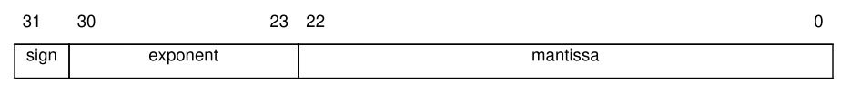

# Exam of 22.02.2021
Exam of the Computer Architectures course of the master degree in Embedded System (Electronic Engineering) of Politecnico di Torino.<br/>
Tested in EMU8086 version 4.08 and Keil uVision5.<br/>

## Exam Text
Assembly subroutines must comply with the ARM Architecture Procedure Call Standard (AAPCS) standard (about parameter passing, returned value, calleesaved
registers).

### Specification 1
The IEEE-754 SP standard expresses floating-point numbers in 32 bits:

<p align="center">
  
</p>

Bit 31 is 0 if the number is positive, 1 if negative.

Some notable values are:
- all bits of exponent and mantissa are 0: zero
- exponent = `1111 1111`, mantissa > 0: NaN (not a number).

Write the `divideFPnumbers` subroutine, which receives in input two 32-bit numbers (dividend and divisor, in this order), considers them as IEEE-754 SP floating point numbers, and returns their quotient (in the same format). As a simplification, it is assumed that the lowest 16 bits of the mantissa of the divisor are 0.

In details, the subroutine implements the following steps:
1. the sign of the result is 0 (positive) if dividend and divisor have the same sign, 1 (negative) otherwise
2. the exponent of the result is: exponent of dividend – exponent of divisor + 126
3. if the dividend is zero (i.e. all bits of exponent and mantissa are 0), then the mantissa of the dividend is 0. Otherwhise:
    - take the mantissa of the dividend
    - shift left the mantissa of the dividend by 8 positions
    - set bit 31 of the mantissa of the dividend to 1
4. if the divisor is zero (i.e. all bits of exponent and mantissa are 0), then the mantissa of the divisor is 0. Otherwhise:
    - take the mantissa of the divisor
    - shift right the mantissa of the divisor by 16 positions
    - set bit 7 of the mantissa of the divisor to 1
5. the mantissa of the result is: mantissa of dividend / mantissa of divisor. / is the unsigned integer division
6. if bit 24 of the mantissa of the result is set:
    - shift right the mantissa of the result by 1 position
    - add 1 to the exponent of the result computed at step 2
7. set bit 23 of the mantissa of the result to 0
8. combine sign, exponent, and mantissa to get the final result.

#### Example
`dividend = 0100 0100 0101 0010 0010 0001 0000 0100`<br/>
`divisor = 1100 0000 1001 0101 0000 0000 0000 0000`
1. `sign of dividend = 0`<br/>
  `sign of divisor = 1`<br/>
  `sign of result = 1`
2. `exponent of dividend = 1000 1000`<br/>
  `exponent of divisor = 1000 0001`<br/>
  `exponent of result = 1000 1000 - 1000 0001 + 0111 1110 = 1000 0101`
3. dividend is not zero
    - `mantissa of dividend = 0000 0000 0101 0010 0010 0001 0000 0100`<br/>
    - `mantissa of dividend = 0101 0010 0010 0001 0000 0100 0000 0000`<br/>
    - `mantissa of dividend = 1101 0010 0010 0001 0000 0100 0000 0000`
4. divisor is not zero
    - `mantissa of divisor = 0000 0000 0001 0101 0000 0000 0000 0000`<br/>
    - `mantissa of divisor = 0000 0000 0000 0000 0000 0000 0001 0101`<br/>
    - `mantissa of divisor = 0000 0000 0000 0000 0000 0000 1001 0101`
5. `mantissa of result = 0000 0001 0110 1001 0000 0110 1110 0110`
6. bit 24 of the mantissa of the result is set
    - `mantissa of result = 0000 0000 1011 0100 1000 0011 0111 0011`<br/>
    - `exponent of result = 1000 0101 + 1 = 1000 0110`
7. `mantissa of result = 0000 0000 0011 0100 1000 0011 0111 0011`
8. `result = 1100 0011 0011 0100 1000 0011 0111 0011`

### Specification 2
Write an exception handler that returns a NaN value when a division by zero occurs at step 5 of previous algorithm.

The division by zero exception is managed by means of the following registers:
- System Handler Control and State Register: size 32 bits, address `0xE000ED24`
- Configuration Control Register: size 32 bits, address `0xE000ED14`
- Usage Fault Status register: 16 bits, address `0xE000ED2A`

The meaning of the bits in the System Handler Control and State Register is as follows:
- Bit 18: enable usage fault handler
- Bit 17: enable bus fault handler
- Bit 16: enable memory management fault handler
- Bit 15: SVC pended
- Bit 14: Bus fault pended
- Bit 13: Memory management fault pended
- Bit 12: Usage fault pended
- Bit 11: Read as 1 if SYSTICK exception is active
- Bit 10: Read as 1 if PendSV exception is active
- Bit 8: Read as 1 if debug monitor exception is active
- Bit 7: Read as 1 if SVC exception is active
- Bit 3: Read as 1 if usage fault exception is active
- Bit 1: Read as 1 if bus fault exception is active
- Bit 0: Read as 1 if memory management fault is active.

The Configuration Control Register enables the following actions if the corresponding bit is set:
- Bit 9: Force exception stacking start in double word aligned address.
- Bit 8: Ignore data bus fault during hard fault and NMI.
- Bit 4: Trap on divide by 0
- Bit 3: Trap on unaligned accesses
- Bit 1: Allow user code to write to Software Trigger Interrupt register
- Bit 0: Allow exception handler to return to thread state at any level by controlling return value.

The bits in the Usage Fault Status register explains the cause of the usage fault:
- Bit 9: Division by zero and DIV_0_TRP is set.
- Bit 8: Unaligned memory access attempted and UNALIGN_TRP is set
- Bit 3: Attempt to execute a coprocessor instruction
- Bit 2: Invalid EXC_RETURN during exception return. Invalid exception active status. Invalid value of stacked IPSR (stack corruption). Invalid ICI/IT bit for current instruction.
- Bit 1: Branch target address to PC with LSB equals 0.
- Bit 0: Use of not supported (undefined) instruction.

Add a label to the last instruction of the divideFPnumbers subroutine. For example<br/>
`lastInstruction     POP {r4-r7, PC}`

The exception handler must check if the current usage fault exception is caused by a division by zero. If so, it moves `0x7FFFFFFF` (corresponding to NaN) to the value or `r0` stored in the stack and changes the value of `PC` stored in the stack such that the next instruction after the exception handler will be at label `lastInstruction`.

For simplicity, you can assume that in thread mode the same stack is used as in handler mode (i.e., the main stack pointer). When the exception is entered, register `r0` is automatically saved at the top of the stack, and `PC` is saved in the stack with offset 24.

### Specification 3
Given a 3 x 3 matrix of bytes `SOURCE` representing unsigned numbers, write a 8086 assembly program which computes (in circular buffer mode) the addition of each row element with the corresponding same column element in the row immediately below and stores the result on 16 bits in the same position of a matrix `DESTINATION`.
The last row elements do add up with the corresponding first row elements (i.e. circular buffer mode).
Please add significant comments to the code and instructions.

#### Example
Initial matrix `SOURCE`
```
1 2 3
4 5 6
7 8 9
```
the following matrix `DESTINATION` is computed
```
5 7 9
11 13 15
8 10 12
```
